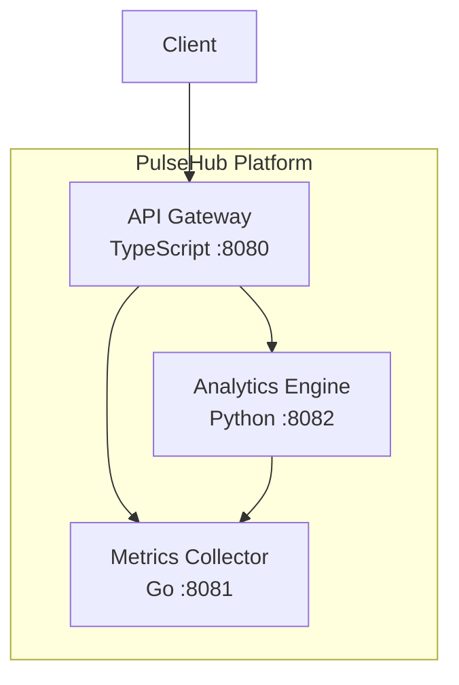

# PulseHub Platform

Real-time microservices health monitoring and metrics aggregation platform. Collect, analyze, and visualize health metrics across your service fleet through a unified API gateway.

## Architecture



### Services

| Service | Language | Port | Description |
|---------|----------|------|-------------|
| **Gateway** | TypeScript (Express) | 8080 | API gateway — routes and proxies requests to backend services |
| **Collector** | Go (net/http) | 8081 | Metrics ingestion and storage engine |
| **Analytics** | Python (Flask) | 8082 | Statistical analysis and aggregation of collected metrics |

## Quick Start

### Prerequisites

- Docker & Docker Compose
- (For local dev) Go 1.21+, Python 3.12+, Node.js 20+

### Run with Docker Compose

```bash
cp .env.example .env
make up
```

### Stop

```bash
make down
```

### Run Tests

```bash
make test
```

### Lint

```bash
make lint
```

## API Specification

All endpoints are available through the Gateway service at `http://localhost:8080`.

### Health Checks

Each service exposes a `/health` endpoint:

```bash
# Gateway
curl http://localhost:8080/health

# Collector (direct)
curl http://localhost:8081/health

# Analytics (direct)
curl http://localhost:8082/health
```

Response:
```json
{"status": "ok", "service": "<service-name>"}
```

### POST /api/metrics

Submit a metric data point.

```bash
curl -X POST http://localhost:8080/api/metrics \
  -H "Content-Type: application/json" \
  -d '{"service": "web-app", "name": "cpu_usage", "value": 72.5}'
```

Response (`201 Created`):
```json
{"status": "created"}
```

### GET /api/metrics

Retrieve all collected metrics.

```bash
curl http://localhost:8080/api/metrics
```

Response:
```json
[
  {
    "service": "web-app",
    "name": "cpu_usage",
    "value": 72.5,
    "timestamp": "2024-01-15T10:30:00Z"
  }
]
```

### GET /api/summary

Get statistical summary of all metrics, grouped by service/metric name.

```bash
curl http://localhost:8080/api/summary
```

Response:
```json
{
  "total_metrics": 3,
  "services": {
    "web-app/cpu_usage": {
      "count": 2,
      "mean": 65.0,
      "stdev": 10.6066,
      "min": 57.5,
      "max": 72.5
    }
  }
}
```

### POST /api/analyze

Analyze a custom set of metrics (without storing them).

```bash
curl -X POST http://localhost:8080/api/analyze \
  -H "Content-Type: application/json" \
  -d '{"metrics": [{"service":"db","name":"latency","value":120},{"service":"db","name":"latency","value":85}]}'
```

## Environment Variables

See `.env.example` for all available configuration:

| Variable | Default | Description |
|----------|---------|-------------|
| `GATEWAY_PORT` | 8080 | Gateway listen port |
| `COLLECTOR_PORT` | 8081 | Collector listen port |
| `ANALYTICS_PORT` | 8082 | Analytics listen port |
| `COLLECTOR_URL` | `http://localhost:8081` | Collector URL (used by gateway & analytics) |
| `ANALYTICS_URL` | `http://localhost:8082` | Analytics URL (used by gateway) |

## Project Structure

```
pulsehub-platform/
├── docker-compose.yml
├── Makefile
├── .env.example
├── .gitignore
├── .github/workflows/ci.yml
├── services/
│   ├── collector/          # Go - Metrics collector
│   │   ├── main.go
│   │   ├── main_test.go
│   │   ├── go.mod
│   │   └── Dockerfile
│   ├── analytics/          # Python - Analytics engine
│   │   ├── app.py
│   │   ├── test_app.py
│   │   ├── requirements.txt
│   │   └── Dockerfile
│   └── gateway/            # TypeScript - API gateway
│       ├── src/
│       │   ├── index.ts
│       │   └── index.test.ts
│       ├── package.json
│       ├── tsconfig.json
│       ├── jest.config.js
│       └── Dockerfile
└── README.md
```

## CI/CD

GitHub Actions runs on every push and PR to `main`:

1. **test-go** — Runs Go unit tests for the collector service
2. **test-python** — Lints and tests the analytics service
3. **test-typescript** — Type-checks and tests the gateway service
4. **docker-build** — Builds all Docker images (runs after tests pass)

> **Note**: The `.github/workflows/ci.yml` file may need to be manually added after initial repository setup due to GitHub API restrictions on the `.github/` directory.
